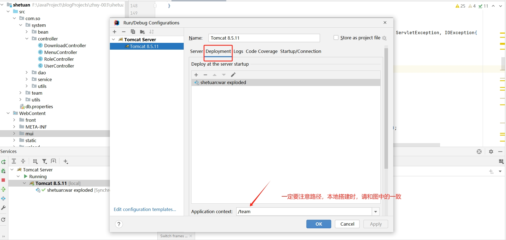
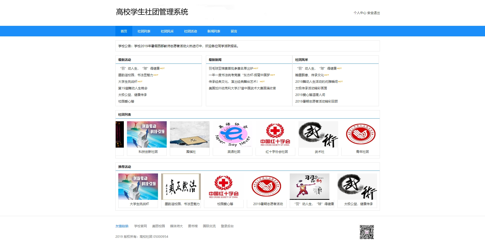
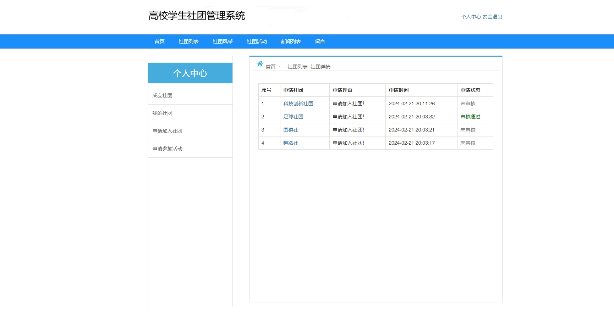
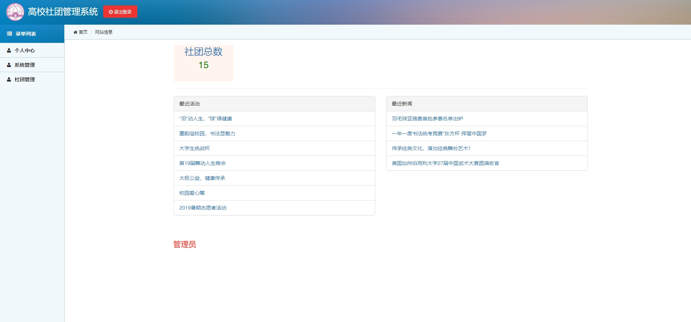
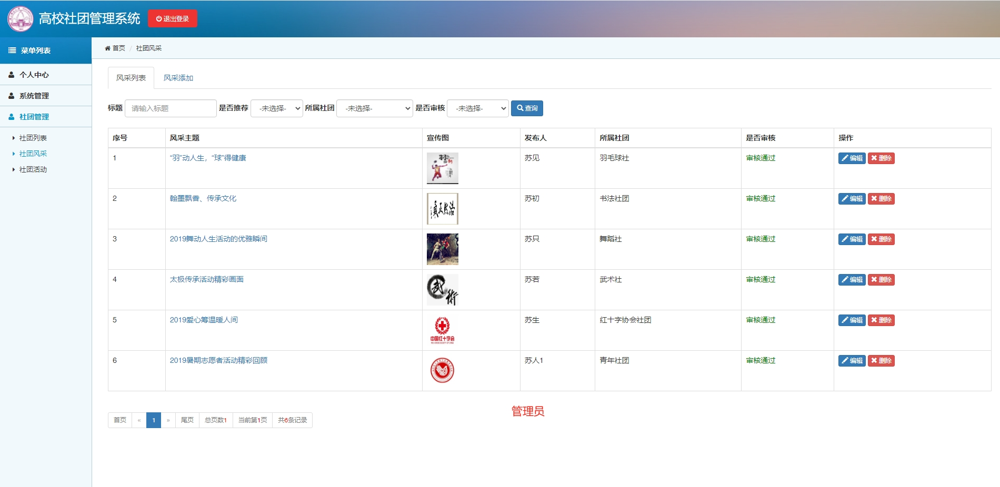
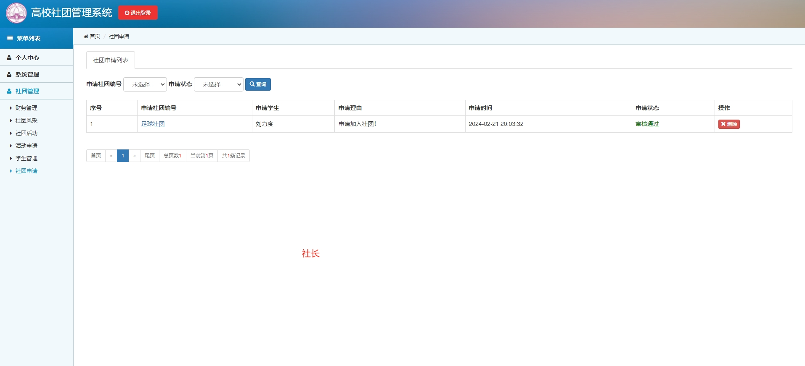

 **郑重声明：项目经过本地测试，确保可以运行， 可以用于学习和毕业设计参考~** 

[点我获取源码](https://x-x.fun/e/OUf380e203kC5)💕🤞

[点我查看更多](http://blog.cyrobot.top/blog)💕🤞

#### 1.项目介绍
- 功能完整的Java高校社团管理系统源码，前后台都有。角色有：学生、社长、管理员。
- 前台功能：首页，社团列表，社团风采，社团活动，新闻列表，留言，登录注册，个人中心等。
- 后台功能：个人中心、用户管理、角色管理、菜单管理、留言管理、新闻管理、财务管理、社团列表、社团风采、社团活动、活动申请、学生管理、社团申请等等功能
- 运行环境：IDEA+tomcat7.0+jdk1.7或以上
- 技术选型：jsp+servlet

#### 2.本地搭建
- 创建数据库，导入源码中team.sql文件
- 下载源码，解压到本地，通过IDEA工具打开
- 配置项目中的src/db.properties里的数据库名和账户密码，修改和本地环境一致
- 创建Tomcat Local server，注意！！！！要设置tomcat配置项中deployment的路径和下图一致

启动成功后，打开门户网站 ： http://localhost:8080/team/  账号可自行注册，或者使用测试账号： stu2 / 123
打开后端页面登录：http://localhost:8080/team/mui/login.jsp  社长账号： 苏秋 / 123456   管理员账号：admin / 123456

#### 3.项目部分截图
